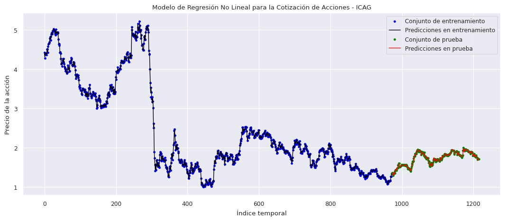
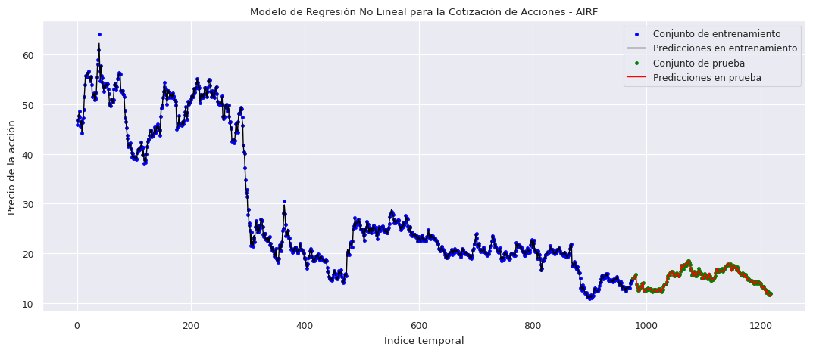

# Stock Price Prediction Exercise

### Study using Linear and Non-Linear Regression methods for short-term Stock Price Forecast

### Author: Gregorio Mendoza Serrano

In this feedback exercise, an analysis of the stock prices (obtained from investing.com) of two companies will be performed using historic data corresponding to the following time period: 

*From: January 1, 2019 - To: October 1, 2023*

The analyzed companies are the following:

1. `ICAG`: *International Consolidated Airlines Group*, an air transport consortium that brings together airlines such as Iberia, British Airways, Vueling, Level and Aer Lingus.

2. `AIRF`: *Air France KLM Group*, an airline consortium led by Air France and KLM airlines and which is a direct competitor of the ICAG consortium.

Additionally, other magnitudes (*Open, High, Low, Vol. and Change %*) will be studied to draw conclusions on top of the stock price forecast.

